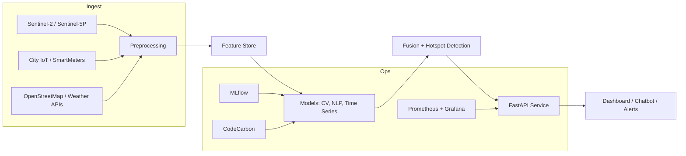

# 🌍 Urban Carbon Intelligence Platform (UCIP)

[](https://opensource.org/licenses/MIT)
[](https://www.python.org/downloads/)
[](https://nittanyai.psu.edu/)

An **open-source, zero-budget MVP** designed for the **NittanyAI Challenge**, enabling real-time measurement, forecasting, and simulation of carbon emissions for **Pennsylvania campuses and cities**.

---

## 🚀 Quick Start

### Start Services
```bash
# Start infrastructure
docker-compose up -d

# Start API
cd api && uvicorn main:app --reload --port 8000

# Start Dashboard
cd dashboard && npm run dev
```

### Access URLs
- **🏥 API Health**: http://localhost:8000/health
- **📚 API Docs**: http://localhost:8000/docs
- **📊 Dashboard**: http://localhost:3000
- **🤖 AI Assistant**: Available in dashboard

---

## 🚀 Vision

UCIP empowers planners, sustainability officers, and researchers to:
- **Measure** emissions using satellite EO + IoT + city data
- **Forecast** hotspots and simulate policy interventions
- **Act** with explainable insights using ethical, transparent AI

---

## 🎯 Target: Pennsylvania First

### Pilot Phase
- Penn State University Park + 2-3 Commonwealth campuses
- Validate 1 building + 1 policy intervention with measurable deltas in ≤14 days

### Expansion
1. **City wave**: Philadelphia, Pittsburgh, Erie, Allentown, Reading
2. **County wave**: County rollups and transportation corridors (I-76/I-80/I-81)
3. **Statewide ops**: Standardized APIs for municipalities, school districts, MPOs

---

## 🧩 Architecture Overview



---

## 📁 Project Structure

```
UCIP/
├── ingestion/              # Data ingestion pipelines
│   ├── satellite/          # Sentinel, VIIRS, Landsat
│   ├── iot/                # Building meters, sensors
│   ├── city_data/          # PennDOT, PA DEP, open data
│   └── weather/            # NOAA, weather APIs
├── features/               # Feature engineering
│   ├── cv_features/        # Computer vision features
│   ├── ts_features/        # Time series features
│   └── nlp_features/       # NLP embeddings
├── models/                 # ML models
│   ├── cv/                 # Segmentation, detection
│   ├── time_series/        # Forecasting, anomaly detection
│   └── nlp/                # Policy analysis, RAG
├── fusion/                 # Hotspot detection & scoring
├── api/                    # FastAPI service
├── dashboard/              # React + Mapbox UI
├── chatbot/                # AI assistant with RAG
├── ops/                    # Docker, MLflow, monitoring
├── tests/                  # Unit and integration tests
└── docs/                   # Documentation
```

---

## 🚦 Quick Start

### Prerequisites
- Python 3.10+
- Docker & Docker Compose
- Node.js 18+ (for dashboard)
- PostgreSQL with PostGIS
- Redis
- MinIO (S3-compatible storage)

### Installation

```bash
# Clone the repository
git clone https://github.com/yourusername/UCIP.git
cd UCIP

# Setup Python environment
python -m venv venv
source venv/bin/activate  # On Windows: venv\Scripts\activate

# Install dependencies
pip install -r requirements.txt

# Setup infrastructure with Docker
docker-compose up -d

# Run database migrations
alembic upgrade head

# Start the API server
cd api
uvicorn main:app --reload --host 0.0.0.0 --port 8000

curl http://localhost:8000/health 

# In a new terminal, start the dashboard
cd dashboard
npm install
npm run dev
```

DASHBOARD - http://localhost:3000

---

## 🔑 Key Features

### 1. **Computer Vision (CV)**
- Building/roof segmentation using U-Net/SegFormer
- Traffic detection with YOLOv8
- Night-light analysis for energy consumption proxies
- Industrial emissions plume detection

### 2. **Time Series Forecasting**
- LSTM/Prophet/ARIMA for emissions forecasting
- Anomaly detection for hotspot alerts
- After-hours energy usage detection

### 3. **NLP Policy Analysis**
- RAG over PSU/city policy documents
- Extract targets, schedules, intervention constraints
- Policy impact simulation with citations

### 4. **Fusion Engine**
- Combines CV + TS + NLP outputs
- Priority-ranked hotspots with risk scores
- Policy-linked recommendations

### 5. **AI Chatbot**
- Planner copilot for where/why/what-if queries
- Citations and map links
- Natural language policy search

### 6. **Dashboard**
- Interactive maps with Mapbox
- Real-time emissions visualizations
- Policy simulator interface
- Compliance reporting

---

## 📊 Pennsylvania Data Sources

### Public/Open
- **PennDOT**: Traffic counts, corridor datasets
- **PA DEP**: Emissions inventories, air monitoring
- **PJM ISO**: Real-time grid mix, marginal emissions
- **EPA AirNow/AQS**: Air quality data
- **NASA VIIRS**: Night lights
- **Sentinel-2/Landsat**: Satellite imagery
- **City portals**: Philadelphia, Pittsburgh open data

### Partner Data (as available)
- PSU OPP building meters and schedules
- Municipal energy dashboards
- Utility interval data (Green Button Connect)

---

## 🎯 Challenge MVP Success Metrics

- ✅ Detect ≥3 actionable hotspots on campus
- ✅ Implement ≥1 intervention with ≥5-10% reduction in 14 days
- ✅ Generate ≥1 compliance-ready report with citations
- ✅ Secure 1-2 partner letters of support

---

## 🛠️ Technology Stack

### Backend
- **Python 3.10+**: Core language
- **FastAPI**: API framework
- **PostgreSQL + PostGIS**: Geospatial database
- **Redis**: Feature store cache
- **MinIO**: Object storage
- **MLflow**: Model registry
- **CodeCarbon**: Carbon tracking

### ML/AI
- **PyTorch**: Deep learning
- **Transformers**: NLP models
- **Prophet/ARIMA**: Time series
- **LangChain**: RAG pipeline
- **FAISS/Milvus**: Vector search

### Frontend
- **React + TypeScript**: UI framework
- **Mapbox GL JS**: Interactive maps
- **Plotly**: Data visualizations
- **TailwindCSS**: Styling

### DevOps
- **Docker + Compose**: Containerization
- **GitHub Actions**: CI/CD
- **Prometheus + Grafana**: Monitoring
- **pytest**: Testing

---

## 🧪 Testing

```bash
# Run all tests
pytest

# Run with coverage
pytest --cov=. --cov-report=html

# Run specific test suite
pytest tests/test_cv.py
```

---

## 📖 Documentation

Full documentation is available in the `docs/` directory:
- [Architecture Guide](docs/architecture.md)
- [API Reference](docs/api.md)
- [Model Documentation](docs/models.md)
- [Deployment Guide](docs/deployment.md)

---

## 🤝 Contributing

We welcome contributions! Please see [CONTRIBUTING.md](CONTRIBUTING.md) for guidelines.

---

## 📄 License

This project is licensed under the MIT License - see [LICENSE](LICENSE) for details.

---

## 🏆 NittanyAI Challenge

This project is submitted for the NittanyAI Challenge 2025. For more information:
- [NittanyAI Alliance](https://nittanyai.psu.edu/)
- [Challenge Details](https://nittanyai.psu.edu/alliance-programs/nittany-ai-challenge/)

---

## 📧 Contact

- **Team Lead**: [Your Name]
- **Email**: [your.email@psu.edu]
- **Project Website**: [Coming Soon]

---

## 🙏 Acknowledgments

- Penn State Sustainability Institute
- Penn State Office of Physical Plant
- NittanyAI Alliance
- Open data providers: PennDOT, PA DEP, EPA, NASA

---

**Built with ❤️ for a sustainable Pennsylvania**

